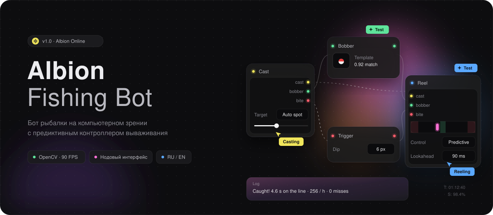
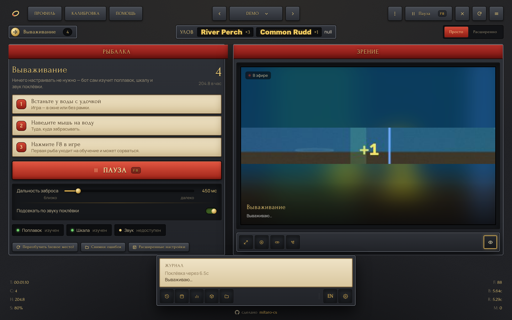
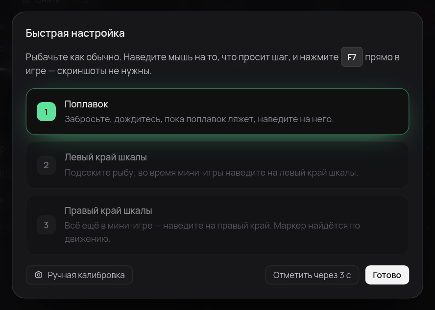
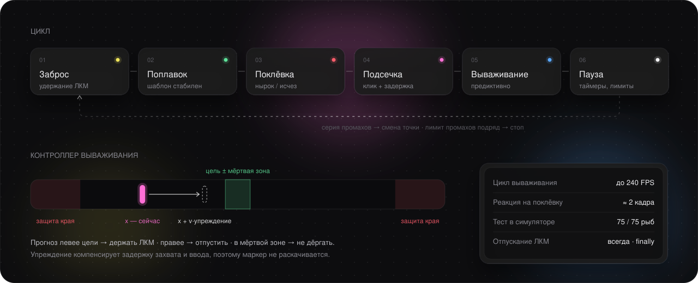
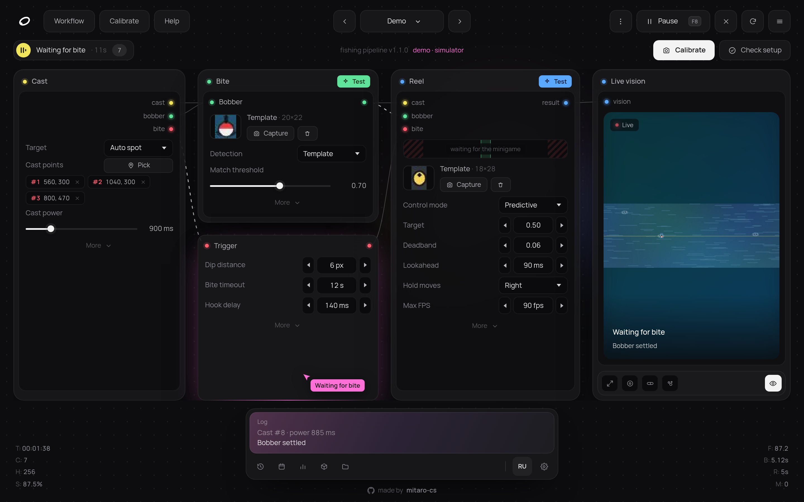

<p align="center">
  
</p>

<p align="center">
  <a href="https://github.com/mitaro-cs/Albion-Online-Fishing-Bot/actions/workflows/ci.yml"></a>
  
  
  
  
</p>

<p align="center">
  <a href="#-быстрый-старт">Быстрый старт</a> ·
  <a href="#-как-пользоваться">Как пользоваться</a> ·
  <a href="#-как-это-работает">Как это работает</a> ·
  <a href="#-настройки">Настройки</a> ·
  <a href="#-решение-проблем">FAQ</a> ·
  <a href="#english">English</a>
</p>

<br>

<p align="center">
  
</p>

<br>

## ◦ Что умеет

<table>
<tr>
<td width="50%" valign="top">

**● Заброс**<br>
<sub>Курсор, список точек или авто-поиск косяков по шаблону. Сила заброса и прицел с разбросом, смена точки после серии промахов.</sub>

</td>
<td width="50%" valign="top">

**● Поклёвка**<br>
<sub>Поплавок ищется шаблоном или по цвету (HSV). Поклёвка — нырок на N px или исчезновение, подтверждённое несколькими кадрами.</sub>

</td>
</tr>
<tr>
<td valign="top">

**● Вываживание**<br>
<sub>Предиктивный контроллер: прогнозирует маркер на 90 мс вперёд, держит его в мёртвой зоне и не даёт уйти к краям. До 240 FPS.</sub>

</td>
<td valign="top">

**● Сессия**<br>
<sub>Лимиты улова и времени, перерывы, клавиши по таймеру (еда, наживка), стоп после серии промахов.</sub>

</td>
</tr>
<tr>
<td valign="top">

**● Надёжность**<br>
<sub>Пауза, если игра не в фокусе, аварийный угол, кнопка мыши всегда отпускается, атомарное сохранение конфига, ретраи захвата экрана.</sub>

</td>
<td valign="top">

**● Интерфейс**<br>
<sub>Фиксированная нодовая панель на весь экран с живым «зрением» бота, настройка в один клик <kbd>F7</kbd>, профили, RU / EN, автообновление из GitHub.</sub>

</td>
</tr>
</table>

## ◦ Быстрый старт

**Проще всего:** скачай `AlbionFishingBot.exe` из [Releases](https://github.com/mitaro-cs/Albion-Online-Fishing-Bot/releases/latest), положи в отдельную папку и запусти — Python не нужен. Профили сохраняются рядом, в `data/`. Без игры: `AlbionFishingBot.exe --demo`. Новые версии бот скачивает и ставит сам (проверка sha256; отключается в настройках).

**Из исходников:** Windows 10/11, [Python 3.10+](https://www.python.org/downloads/) (галочка *Add python.exe to PATH*), игра в режиме «Окно» или «Без рамки».

```bat
git clone https://github.com/mitaro-cs/Albion-Online-Fishing-Bot.git
cd Albion-Online-Fishing-Bot
run.bat
```

`run.bat` сам создаст `.venv`, поставит зависимости и откроет окно бота. Без игры можно посмотреть всё вживую на встроенном симуляторе:

```bat
run.bat --demo
```

<details>
<summary>Ручная установка / другие ОС</summary>

```bash
python -m venv .venv && .venv\Scripts\activate      # Linux/macOS: source .venv/bin/activate
pip install -r requirements.txt
python -m fishbot
```

Окно рисуется через WebView2 (есть в Windows 10/11). Если его нет — интерфейс откроется в браузере.
</details>

## ◦ Как пользоваться

Настраивать ничего не нужно.

1. Встань у воды с удочкой (игра — в окне или без рамки).
2. Наведи мышь на воду, куда забрасывать.
3. Нажми <kbd>F8</kbd> в игре.

Бот сам всё изучит:

- **Поплавок** — сравнивает воду до и после заброса; новый предмет на воде и есть поплавок.
- **Шкала мини-игры** — сравнивает экран до и после подсечки; новая длинная полоса с зелёной зоной — шкала, а маркер — то, что на ней движется (неподвижные значки и подсказки отбрасываются).
- **Вываживание** — каждый кадр находит зелёную зону и держит маркер в её центре, куда бы она ни сдвигалась; в первой мини-игре сам проверяет, в какую сторону тянет удержание кнопки.
- **Поклёвка** — подсекает на любой из признаков: звук всплеска (слушает звук игры, микрофон не нужен), нырок поплавка, его исчезновение или резкое движение воды вокруг.

Первая рыба уходит на обучение и может сорваться; дальше всё сохраняется в профиль. Сменил место — нажми **«Переобучить»**. Если бросает слишком далеко или близко — ползунок **«Дальность заброса»**. Больше на главном экране ничего нет; всё остальное — в режиме **«Расширенно»**.

<details>
<summary>Ручная настройка (если автоматика не справилась)</summary>

<br>

**Расширенно → Калибровка** открывает «Быструю настройку»: наведи на поплавок → <kbd>F7</kbd>, в мини-игре наведи на левый край шкалы → <kbd>F7</kbd>, на правый → <kbd>F7</kbd>. Там же есть калибровка по снимку экрана.


</details>

## ◦ Как это работает

<p align="center">
  
</p>

- **Захват** — `mss` снимает только нужную зону (≈1 мс), **поиск** — `cv2.matchTemplate` (TM_CCOEFF_NORMED) или HSV-маска с выбором крупнейшего пятна.
- **Поклёвка** — от поплавка запоминается базовая линия (медиана по кадрам), она плавно следует за волнами; нырок или потеря шаблона N кадров подряд = поклёвка.
- **Вываживание** — скорость маркера сглаживается EMA, прогноз `x + v·упреждение` сравнивается с целью ± мёртвая зона. Гистерезис и минимальный интервал переключения убирают дребезг, защита краёв перехватывает управление у границ.
- **Ввод** — `SendInput` со скан-кодами (игры читают их надёжнее виртуальных клавиш), DPI-aware координаты.
- **Каждый кадр** (и каждые 50 мс любой паузы) проверяются стоп, пауза, фокус и аварийный угол, а выход из любого состояния проходит через `finally` с отпусканием мыши.

## ◦ Настройки

Все параметры меняются прямо в нодах и сохраняются сразу. Границы значений проверяются и в интерфейсе, и в бэкенде.

| Нода | Параметр | По умолчанию | Что делает |
|---|---|---|---|
| Заброс | Цель | Курсор | `Курсор` · `Точки` (по очереди) · `Авто-поиск` косяков |
| | Сила заброса | 900 мс ± 120 | Сколько держать ЛКМ при забросе |
| | Смена точки после | 2 промаха | Переход к следующей точке / другому косяку |
| Поклёвка | Порог совпадения | 0.70 | Ниже — поплавок «не виден» |
| | Глубина нырка | 6 px | Насколько поплавок должен уйти вниз |
| | Ждать поклёвку | 35 с | Потом леска сматывается и заброс повторяется |
| | Подсечка через | 140 мс + 0…80 | Задержка клика после поклёвки |
| Вываживание | Режим | Предиктивный | `Предиктивный` или простой `Гистерезис` |
| | Цель / Мёртвая зона | 0.50 / 0.06 | Где держать маркер на шкале |
| | Упреждение | 90 мс | На сколько вперёд прогнозировать маркер |
| | Удержание тянет | Вправо | Куда сдвигает маркер зажатая ЛКМ |
| | Макс. FPS | 90 | Частота цикла вываживания |
| Сессия | Пауза между забросами | 1400 мс + 0…600 | |
| | Стоп после улова / через | выкл | Лимиты сессии |
| | Перерыв каждые / длина | выкл / 3 мин | Интервал и длина слегка варьируются |
| | Клавиши по таймеру | — | Еда, наживка, баффы: при старте и каждые N минут |
| Настройки | Пауза без фокуса игры | вкл | Окно, заголовок которого содержит `Albion Online` |
| | Аварийный угол | вкл | Мышь в левый верхний угол — мгновенный стоп |

Профили хранятся в `data/profiles/<имя>/` (`config.json` + шаблоны `*.png`) — удобно держать отдельный профиль под каждое место рыбалки.

## ◦ Управление

| Клавиша | Действие |
|---|---|
| <kbd>F8</kbd> | Старт / пауза / продолжить (работает, когда игра в фокусе) |
| <kbd>F9</kbd> | Стоп и отпустить мышь |
| <kbd>F7</kbd> | Отметка шага в «Быстрой настройке» |
| ↖ угол экрана | Аварийная остановка |

Клавиши переназначаются в **Настройках** (шестерёнка в доке).

| Запуск | |
|---|---|
| `run.bat` | Окно приложения |
| `run.bat --demo` | Симулятор вместо игры — попробовать интерфейс и настройки |
| `run.bat --browser` | Интерфейс в браузере |
| `run.bat --cli --profile Мост` | Без интерфейса, сразу рыбачить |
| `--data DIR` · `--port N` · `--debug` | Папка данных, порт UI, подробный лог |
| `--uninstall` | Удалить данные и программу |

## ◦ Удаление

**Настройки → Удалить программу** (или `AlbionFishingBot.exe --uninstall`). Удаляются папка `data/` (профили, шаблоны, настройки, лог, кэш окна), недокачанные обновления и сам exe. Реестр и AppData бот не использует, так что на компьютере ничего не остаётся. При запуске из исходников удаляется только `data/`.

## ◦ Решение проблем

<details>
<summary><b>Поплавок не находится / ложные поклёвки</b></summary>

Переснимите шаблон поплавка плотнее, уменьшите «Зону поплавка», понизьте «Порог совпадения» на 0.05. При частых ложных поклёвках увеличьте «Кадров подряд» и «Глубину нырка». Если вода сильно меняется (ночь, погода) — попробуйте детекцию по цвету.
</details>

<details>
<summary><b>Маркер раскачивается или уходит к краю</b></summary>

Увеличьте «Упреждение» (90 → 130 мс) и «Мёртвую зону». Если маркер стабильно уезжает не в ту сторону — переключите «Удержание тянет». Проверьте, что зона «Шкала» выделена точно по дорожке.
</details>

<details>
<summary><b>Подсекает, но не вытаскивает рыбу</b></summary>

В первой мини-игре бот сам проверяет, в какую сторону удержание кнопки двигает маркер, и после двух срывов подряд перепроверяет. Если не помогает — нажмите **«Снимки ошибок»**: там картинки того, что бот видел, когда не нашёл шкалу или упустил рыбу. Их можно прислать для разбора.
</details>

<details>
<summary><b>Клики не доходят до игры</b></summary>

Если игра запущена от администратора, Windows блокирует ввод от обычных процессов — запустите `run.bat` тоже от администратора. Также проверьте «Заголовок окна игры» в настройках.
</details>

<details>
<summary><b>Не открывается окно</b></summary>

Нет WebView2 — бот откроет интерфейс в браузере автоматически, либо запустите `run.bat --browser`.
</details>

## ◦ Разработка

```
fishbot/
├── engine.py      конечный автомат рыбалки (поток, паузы, лимиты, статистика)
├── controller.py  предиктивный контроллер вываживания
├── vision.py      поиск по шаблону и цвету, отрисовка превью
├── capture.py     захват экрана (mss)
├── controls.py    мышь/клавиатура: SendInput, pynput
├── config.py      типизированный конфиг со схемой + профили
├── api.py         API для интерфейса
├── server.py      локальный HTTP (127.0.0.1, токен)
├── sim.py         симулятор рыбалки для демо и тестов
└── web/           интерфейс: HTML/CSS/JS без зависимостей
```

```bash
pip install -r requirements.txt pytest
python -m pytest
```

Сквозные тесты гоняют настоящий движок против симулятора в виртуальном времени: заброс → поклёвка → вываживание, пауза, потеря фокуса, смена точек, лимиты и перерывы.

## ◦ Дисклеймер

Автоматизация игровых действий нарушает правила Albion Online и может привести к блокировке аккаунта. Проект сделан в образовательных целях — используйте на свой риск.

<br>

<a id="english"></a>
<details>
<summary><b>English</b></summary>

<br>

<p align="center"></p>

Screen-vision fishing bot for Albion Online with a predictive reel controller and a node-based UI (English / Russian).

**Quick start** (Windows 10/11, Python 3.10+): `git clone …`, then `run.bat`. Try it without the game: `run.bat --demo`.

**No setup:** stand at the water, point the mouse at it and press <kbd>F8</kbd>. The bot learns the bobber (what appears after the cast), the reel bar (what appears after the hook) and hooks on the bite splash sound, a dip, the bobber vanishing or a burst of motion. Moved to a new spot — press *Relearn*. Manual calibration is still available in *Advanced*.

**Hotkeys:** <kbd>F8</kbd> start / pause, <kbd>F9</kbd> stop, mouse to the top-left corner — emergency stop. The bot pauses automatically when the game loses focus and always releases the mouse button on exit.

**Disclaimer:** automation is against the Albion Online rules and may get your account banned. Educational project, use at your own risk.
</details>
