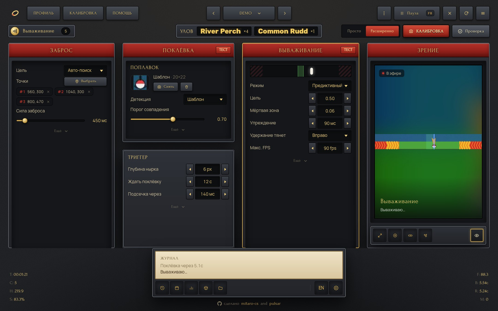
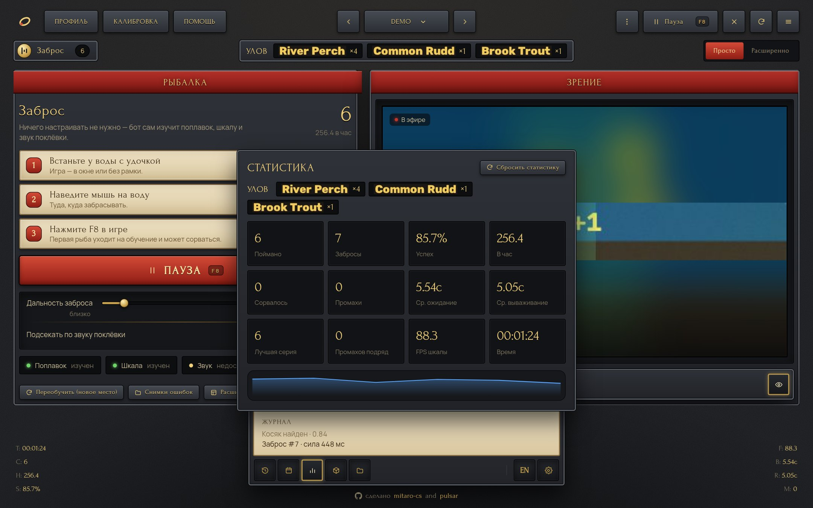
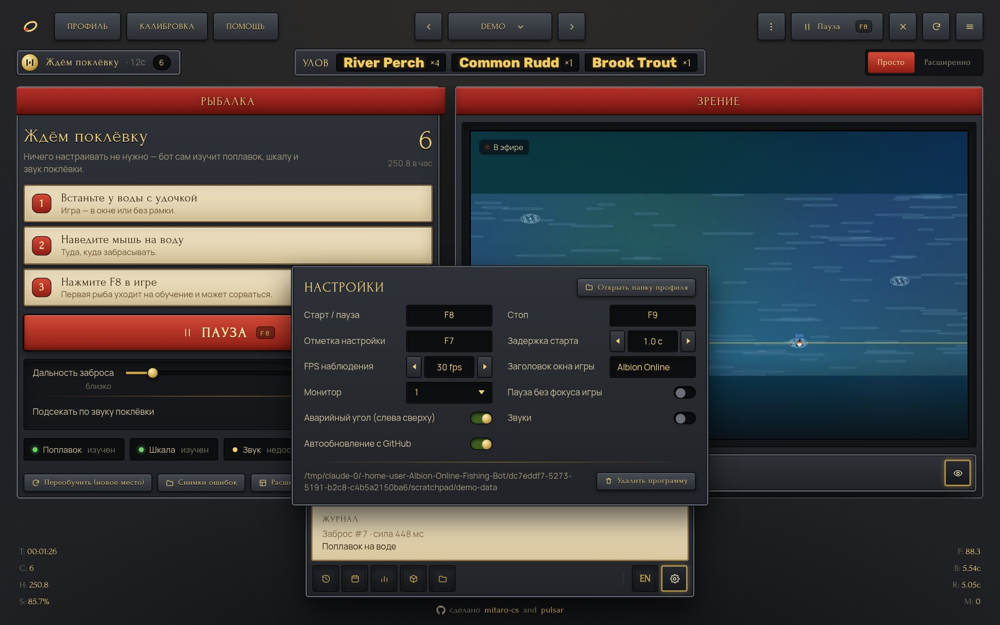

<h1 align="center">🎣 Albion Fishing Bot</h1>

<p align="center">
  <b>Автоматическая рыбалка в Albion Online: сам находит поплавок, ловит поклёвку и держит рыбу в зелёной зоне.</b><br>
  Один exe. Без установки, без ручной разметки скриншотов.
</p>

<p align="center">
  <a href="https://github.com/mitaro-cs/Albion-Online-Fishing-Bot/releases/latest/download/AlbionFishingBot.exe"></a>
</p>

<p align="center">
  <a href="https://github.com/mitaro-cs/Albion-Online-Fishing-Bot/releases/latest"></a>
  <a href="https://github.com/mitaro-cs/Albion-Online-Fishing-Bot/actions/workflows/ci.yml"></a>
  
  
</p>

<p align="center">
  
  <br><sub>Настоящее окно программы (запущено в демо-режиме на встроенном симуляторе).</sub>
</p>

---

## Как пользоваться

1. **Скачайте** [`AlbionFishingBot.exe`](https://github.com/mitaro-cs/Albion-Online-Fishing-Bot/releases/latest/download/AlbionFishingBot.exe) и запустите. Установка не нужна.
2. **Встаньте у воды** в игре с удочкой в руках.
3. Нажмите **«Старт»** (или <kbd>F8</kbd>). Всё остальное бот сделает сам.

При первом забросе бот запоминает, где упал поплавок и как выглядит мини‑игра. Дальше он ловит без вашего участия. Если что‑то пошло не так, нажмите **«Забыть»**, и он выучит всё заново.

| Клавиша | Действие |
|---|---|
| <kbd>F8</kbd> | старт / пауза |
| <kbd>F9</kbd> | стоп |
| <kbd>F7</kbd> | быстрая настройка по курсору (если автопоиск не справился) |

## Что умеет

| | |
|---|---|
| 🧠 **Автообучение** | Находит поплавок по разнице кадров до и после заброса, а полосу мини‑игры по цвету (зелёная зона и красные края). Направление тяги определяет сам. |
| 🔔 **Поклёвка** | Реагирует на нырок поплавка, всплеск и **звук клёва**. Звук берётся только из процесса игры, поэтому музыка, видео и Discord его не сбивают. |
| 🟩 **Вываживание** | Держит поплавок в зелёной зоне, ближе к центру. Предсказывает движение, чтобы не перелетать границы. |
| 📜 **Сводка улова** | Читает баннер «Получено N шт.» вверху экрана через встроенное OCR Windows и считает каждую рыбу по названию. |
| ⚡ **Частые забросы** | Короткая пауза между циклами со случайным разбросом. |
| 🔄 **Автообновление** | Сам проверяет GitHub Releases, сверяет SHA‑256 и ставит новую версию. |
| 🗝️ **Надёжное хранение** | Настройки лежат в реестре (`HKCU\Software\AlbionFishingBot`), а не в папке рядом с exe, поэтому их не удалить случайно. |
| 🧹 **Чистое удаление** | Кнопка «Удалить программу» стирает реестр, кэш и сам exe. На компьютере ничего не остаётся. |

## Скриншоты

<table>
  <tr>
    <td width="50%"><br><sub><b>Расширенный режим.</b> Весь конвейер: захват → поплавок → поклёвка → вываживание.</sub></td>
    <td width="50%"><br><sub><b>Статистика и улов.</b> Счётчики, журнал событий, сводка по рыбе.</sub></td>
  </tr>
  <tr>
    <td colspan="2"><br><sub><b>Настройки.</b> Чувствительность звука, пауза между забросами, горячие клавиши, язык.</sub></td>
  </tr>
</table>

<sub>Все скриншоты сняты с настоящего приложения. Игра на них заменена встроенным симулятором (`--demo`).</sub>

## Как это работает

- **Захват:** быстрый снимок нужной области экрана через `mss`. Весь экран не обрабатывается.
- **Заброс:** бот сравнивает воду до и после броска и находит поплавок.
- **Поклёвка:** срабатывает любой из сигналов: поплавок пропал, нырнул, был всплеск или резкий скачок громкости в аудиосессии игры.
- **Вываживание:** полоса ищется по цвету. Контроллер с упреждением держит поплавок в середине зелёного участка. Если полоса «застыла», бот сам её переучивает.
- **Улов:** находит баннер добычи и распознаёт его текст. Если OCR недоступно, сравнивает картинки баннеров.
- **Безопасность:** клики только в окно Albion, случайные задержки, пауза при потере фокуса.

## Данные и удаление

| Что | Где |
|---|---|
| Профили и настройки | реестр `HKCU\Software\AlbionFishingBot` |
| Лог, отладка, кэш окна | `%LOCALAPPDATA%\AlbionFishingBot` |

**Настройки → «Удалить программу»** (или `AlbionFishingBot.exe --uninstall`) удаляет и то и другое, а после выхода и сам exe.

## FAQ

<details>
<summary><b>Бот не реагирует на поклёвку</b></summary>

Убедитесь, что звук игры не выключен в микшере Windows: громкость может быть низкой, но не нулевой. Если всё равно не реагирует, поднимите «Чувствительность звука» в настройках или нажмите «Забыть», чтобы бот заново нашёл поплавок.
</details>

<details>
<summary><b>Рыба срывается</b></summary>

Нажмите «Забыть», чтобы бот заново нашёл полосу мини‑игры. Играйте в оконном режиме или в режиме «без рамки» и не перекрывайте полосу другими окнами.
</details>

<details>
<summary><b>Windows SmartScreen ругается на exe</b></summary>

Файл не подписан сертификатом. Нажмите «Подробнее» → «Выполнить в любом случае». Exe собирается открыто в GitHub Actions из этого репозитория.
</details>

<details>
<summary><b>Сводка улова пустая</b></summary>

Для распознавания текста нужен русский или английский языковой пакет Windows. Без него бот всё равно считает улов, просто вместо названия показывает миниатюру баннера.
</details>

## Из исходников

```bat
git clone https://github.com/mitaro-cs/Albion-Online-Fishing-Bot
cd Albion-Online-Fishing-Bot
run.bat            :: или: python -m fishbot [--demo]
python -m pytest   :: тесты
```

## Дисклеймер

Автоматизация может нарушать правила Albion Online. Используете на свой риск. Проект сделан в образовательных целях.

---

<p align="center">сделано <a href="https://github.com/mitaro-cs"><b>mitaro-cs</b></a> and <b>pulsar</b></p>
