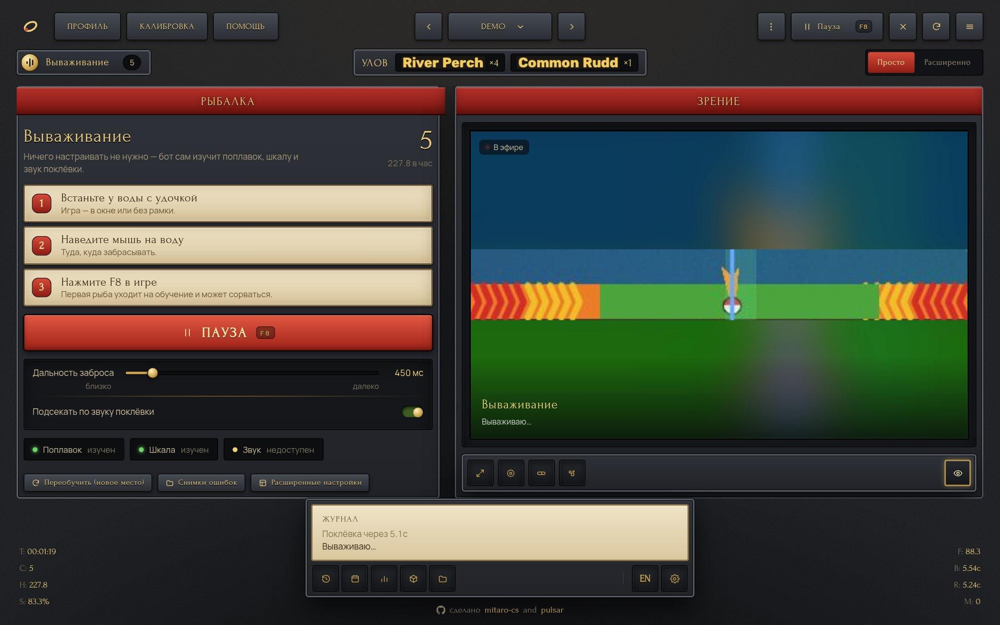
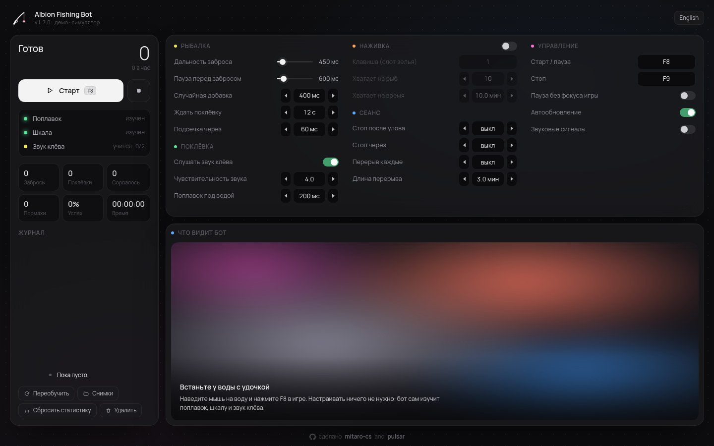
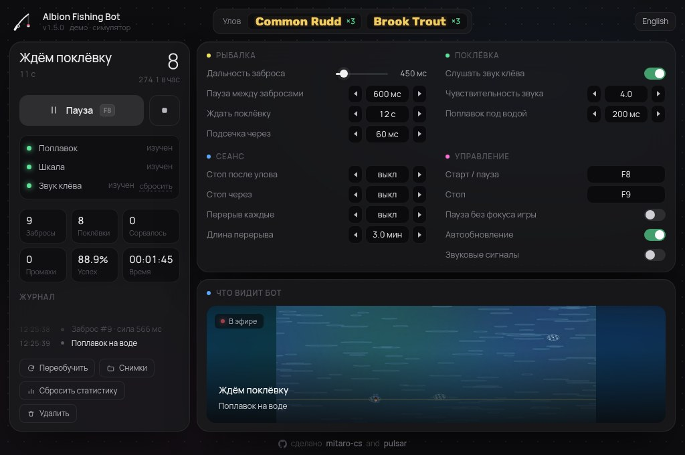

<h1 align="center">🎣 Albion Fishing Bot</h1>

<p align="center">
  <b>Автоматическая рыбалка в Albion Online: сам находит поплавок, ловит поклёвку и держит рыбу в зелёной зоне.</b><br>
  Один exe. Без установки, без ручной разметки скриншотов.
</p>

<p align="center">
  <a href="https://github.com/mitaro-cs/Albion-Online-Fishing-Bot/releases/latest/download/AlbionFishingBot.exe"></a>
</p>

<p align="center">
  <a href="https://github.com/mitaro-cs/Albion-Online-Fishing-Bot/releases/latest"></a>
  <a href="https://github.com/mitaro-cs/Albion-Online-Fishing-Bot/actions/workflows/ci.yml"></a>
  
  
</p>

<p align="center">
  
  <br><sub>Настоящее окно программы (запущено в демо-режиме на встроенном симуляторе).</sub>
</p>

---

## Как пользоваться

1. **Скачайте** [`AlbionFishingBot.exe`](https://github.com/mitaro-cs/Albion-Online-Fishing-Bot/releases/latest/download/AlbionFishingBot.exe) и запустите. Установка не нужна.
2. **Встаньте у воды** в игре с удочкой в руках и **наведите курсор на воду**, куда забрасывать.
3. Нажмите **«Старт»** (или <kbd>F8</kbd>). За 3 секунды отсчёта переключитесь в игру и держите курсор над водой: в конце отсчёта бот запомнит эту точку и дальше всегда забрасывает туда, даже если мышь сдвинется.

Калибровать ничего не нужно. Поплавок бот находит заново на каждом забросе, шкалу мини‑игры — на первой рыбе. Пока бот работает, не переключайтесь на другие окна: без фокуса игры он встаёт на паузу (иначе клики ушли бы не туда). Перешли на другое место? Нажмите <kbd>F8</kbd> (пауза), наведите курсор на воду и снова <kbd>F8</kbd>.

Все настройки на одном экране, без вкладок и прокрутки. Клавиши <kbd>F8</kbd> (старт / пауза) и <kbd>F9</kbd> (стоп) работают прямо в игре и меняются там же, в блоке «Управление».

## Что умеет

| | |
|---|---|
| 🧠 **Без калибровки** | Поплавок находит на каждом забросе: что упало в воду и не похоже на обычный прибой и блики. Шкалу мини‑игры — по синей полосе прогресса под ней и красным краям. Днём, ночью, у берега, рядом с чужими поплавками. |
| 🔔 **Поклёвка** | В Albion поклёвка — это всплеск пены и пузырей вокруг поплавка (сам он почти не тонет). Бот ловит именно резкий всплеск: волны, прибой, блики и подёргивания поплавка не считаются, поэтому «Слишком рано!» нет. |
| 👂 **Звук клёва** | Запоминает, как звучит поклёвка, но только подтверждает им всплеск: звук сам по себе не подсекает никогда (музыка игры его часто заглушает). |
| 🟩 **Вываживание** | Держит поплавок в зелёной зоне, ближе к центру. Предсказывает движение, чтобы не перелетать границы. Мини‑игра считается законченной, только когда исчезла сама шкала. |
| 📜 **Сводка улова** | Читает баннер «Получено N шт.» вверху экрана через встроенное OCR Windows и считает каждую рыбу по названию. |
| ⚡ **Скорость** | «Пауза перед забросом» — ровно столько бот ждёт после рыбы: улов считается в эту же паузу, скрытых задержек нет. |
| 🪱 **Наживка** | Кладёте наживку в слот зелья, бот жмёт её клавишу (по умолчанию <kbd>1</kbd>) при старте и снова, когда она кончается: через 10 рыб или 10 минут, как в игре. |
| ♻️ **Самовосстановление** | Игра проигнорировала заброс (персонаж ещё убирает рыбу) — бот видит, что ничего не упало, и забрасывает снова, без лишних кликов. Каждый «Старт» переучивает всё заново. |
| 🔄 **Автообновление** | Сам проверяет GitHub Releases, сверяет SHA‑256 и ставит новую версию. |
| 🗝️ **Надёжное хранение** | Настройки лежат в реестре (`HKCU\Software\AlbionFishingBot`), а не в папке рядом с exe, поэтому их не удалить случайно. |
| 🧹 **Чистое удаление** | Кнопка «Удалить программу» стирает реестр, кэш и сам exe. На компьютере ничего не остаётся. |

## Скриншоты

<table>
  <tr>
    <td width="50%"><br><sub><b>Первый запуск.</b> Поплавок и шкала уже изучены, звук клёва учится на первых рыбах.</sub></td>
    <td width="50%"><br><sub><b>Маленькое окно (1024×680).</b> Всё по‑прежнему на одном экране, без прокрутки.</sub></td>
  </tr>
</table>

<sub>Все скриншоты сняты с настоящего приложения. Игра на них заменена встроенным симулятором (`--demo`).</sub>

## Как это работает

- **Захват:** быстрый снимок нужной области экрана через `mss`. Весь экран не обрабатывается.
- **Заброс:** перед броском бот 0,6 с смотрит на воду и запоминает, в каких пределах меняется цвет каждой точки (прибой, блики, рябь). Поплавок — то, что после броска вышло далеко за эти пределы рядом с местом прицела. Если ничего не упало, бот забрасывает снова.
- **Поклёвка:** вокруг поплавка (сам он не учитывается) бот считает долю свежей яркой пены. Каждая точка помнит, какой яркой она недавно была, поэтому прибой и блики не считаются. Поклёвка — резкий скачок этой доли за 1–2 кадра.
- **Звук клёва:** бот читает индикатор громкости процесса игры (как в микшере Windows) и запоминает звук настоящих поклёвок. Он только подтверждает всплеск.
- **Вываживание:** шкала ищется по непрозрачной синей полосе прогресса и красным шевронам над ней (зелёная часть шкалы полупрозрачная, сквозь неё видна трава). Бот запоминает вид её концов и каждый кадр проверяет, что шкала на месте. Контроллер с упреждением держит поплавок в середине зелёного участка.
- **Улов:** находит баннер добычи и распознаёт его текст. Если OCR недоступно, сравнивает картинки баннеров.
- **Безопасность:** клики только в окно Albion, случайные задержки, пауза при потере фокуса.

## Данные и удаление

| Что | Где |
|---|---|
| Профили и настройки | реестр `HKCU\Software\AlbionFishingBot` |
| Лог, отладка, кэш окна | `%LOCALAPPDATA%\AlbionFishingBot` |

**Кнопка «Удалить»** (или `AlbionFishingBot.exe --uninstall`) удаляет и то и другое, а после выхода и сам exe.

## FAQ

<details>
<summary><b>Бот не реагирует на поклёвку</b></summary>

Проверьте, что в конце отсчёта курсор был над водой: бот забрасывает именно туда. Поклёвки в Albion бывают и через 40–70 секунд, бот ждёт до 90 секунд («Ждать поклёвку»).
</details>

<details>
<summary><b>Рыба срывается</b></summary>

Не перекрывайте шкалу мини‑игры другими окнами и не переключайтесь из игры во время вываживания: без фокуса бот отпускает кнопку и встаёт на паузу.
</details>

<details>
<summary><b>Как включить наживку</b></summary>

Положите наживку в слот зелья в игре. В блоке «Наживка» включите переключатель и проверьте клавишу (обычно <kbd>1</kbd>). Бот использует её перед первым забросом и затем каждые 10 рыб или 10 минут, смотря что наступит раньше. Оба числа можно поменять.
</details>

<details>
<summary><b>Подсекает слишком рано</b></summary>

Увеличьте «Всплеск длится» (например, до 150 мс): бот будет ждать, пока пена продержится дольше.
</details>

<details>
<summary><b>Windows SmartScreen ругается на exe</b></summary>

Файл не подписан сертификатом. Нажмите «Подробнее» → «Выполнить в любом случае». Exe собирается открыто в GitHub Actions из этого репозитория.
</details>

<details>
<summary><b>Сводка улова пустая</b></summary>

Для распознавания текста нужен русский или английский языковой пакет Windows. Без него бот всё равно считает улов, просто вместо названия показывает миниатюру баннера.
</details>

## Из исходников

```bat
git clone https://github.com/mitaro-cs/Albion-Online-Fishing-Bot
cd Albion-Online-Fishing-Bot
run.bat            :: или: python -m fishbot [--demo]
python -m pytest   :: тесты
```

## Дисклеймер

Автоматизация может нарушать правила Albion Online. Используете на свой риск. Проект сделан в образовательных целях.

---

<p align="center">сделано <a href="https://github.com/mitaro-cs"><b>mitaro-cs</b></a> and <b>pulsar</b></p>
